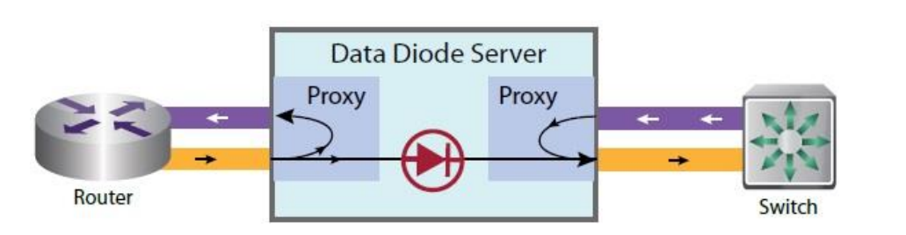

- In this section, I will have some important concepts about air gapped systems which are really important in defense industry and goverment.
- Air gapped system: network or device that has no physical connection to the public internet or unclassified network.
- The important part is "no physical connection". So that we can be ensure there is no flow of data packets to outside.

- I asked AI and it says I must have a look at NIST (National Institute of Standarts and Technology, U.S.) SP 800-53. This standart shows security and privacy controls for information systems. Doc can be found at: https://nvlpubs.nist.gov/nistpubs/SpecialPublications/NIST.SP.800-53r5.pdf

- Security control: safeguards employed within a system to protect confidentialitiy, integrity and availability.
- Privacy control: administrative, physical and technical safeguards employed within a system to manage privacy risks.

- In Access Control section, AC-4 shows information flow enforcement. I saw that in different security domains, information should be filtered, analyzed, checked. But to make it easy for me now, I will have two domains: unclassified and classified network in an organization.
- There will be no pyhiscal or logical connection between these two security domains. Of course there must be flow between these two. For example, a developer in unclassified network should transfer the code into classified network. To make this transfer there should be both pyhsical and logical layers. 

-After some analysis on the data, if the data is verified for the transfer, pyhsical layer (Data Diode) should allow this data to flow from low (unclassified network, low) to n2 (classified network, high). So, there must be two mechanisms: 1. Somehow, verify that package whether it can transfer or not. (Logical layer) 2. Then, use that verification in the physical hardware to allow that data to flow. (Physical layer, data diode) But it should allow only for that data. The term for solutions of this problem is called Cross Domain Solution (CDS).

- In low-to-high transfer, the risk we have is that data we transfer is malicious or not. So there should be system scan for virus, logic bombs, malicious scripts etc.
- In high-to-low transfer, the risk is data leakage (spillage). We dont want our secret data escaping our classfied environment.

- As I mentioned above, data diade only allow data in one direction. But then, a question comes into my mind: how will tcp work, since it requires ack etc? This was a perfect question and solution is also perfect. Data diode has two proxies for each side, and it just sends fake acks to sender and reciver. Perfect. 
- Logical layer checks structure verification (if it is really a PDF), content disarm and reconstruction (CDR, destroy the old file and build one), dirty word search (high-to-low, like top secret), virus scan etc.
